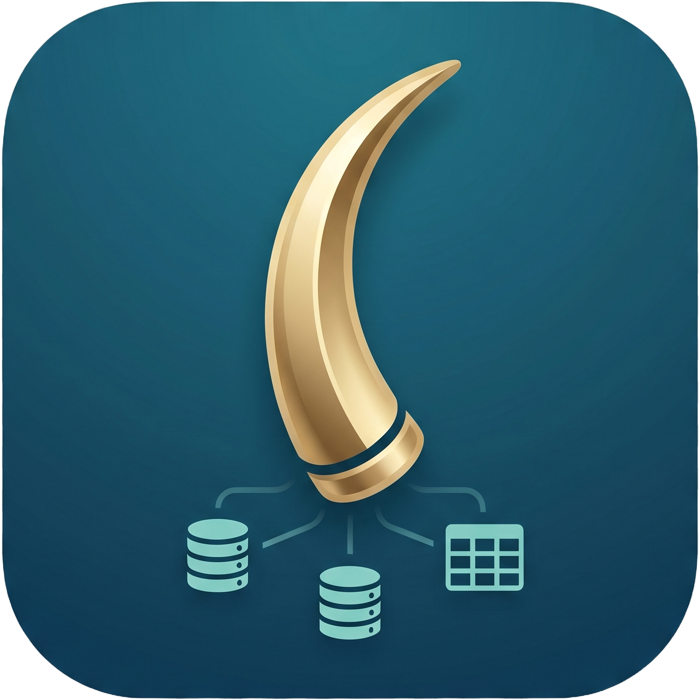

<div align="center">



# Tusk

**A fast, native, lightweight database client.**

Postgres-first — built to replace the clunk of pgAdmin and the resource weight of DataGrip.

[](https://github.com/willkoman/tusk/actions/workflows/validate.yml)
[](https://github.com/willkoman/tusk/releases/latest)
[](https://github.com/willkoman/tusk/releases)
[](LICENSE)
[](#supported-databases)

[Install](#install) · [Features](#what-tusk-does) · [Databases](#supported-databases) · [Docs](#documentation) · [Contributing](#contributing) · [Roadmap](#roadmap)

</div>

Tusk is a SQL workbench built from Rust, [Tauri v2](https://tauri.app), and SolidJS on the **system WebView** — no Electron, no JVM, no bundled browser. It launches in well under a second, idles light, and streams million-row results through a virtualized grid without breaking a sweat. Under the workbench is an execution engine that treats your data with respect: statements are never silently replayed after a dropped connection, multi-statement scripts are atomic by default, in-grid edits show you the exact SQL before anything runs, and nothing — not crash reports, not AI context, not telemetry (there is none) — ever leaves your machine without an explicit action.

> **Status:** actively developed. PostgreSQL is first-class; DuckDB, SQLite, and MySQL are fully connectable with per-engine capability gating. Installers are not yet OS-signed (expect a SmartScreen / Gatekeeper prompt).

---

## Install

Grab the latest from **[Releases](https://github.com/willkoman/tusk/releases/latest)**:

| Platform | File |
|---|---|
| **Windows** (x64) | `tusk_x.y.z_x64-setup.exe` (per-user NSIS installer) or `tusk_x.y.z_x64_en-US.msi` |
| **macOS** (Apple Silicon) | `tusk_x.y.z_aarch64.dmg` |
| **macOS** (Intel) | `tusk_x.y.z_x64.dmg` |
| **Linux** | build from source — see [CONTRIBUTING.md](CONTRIBUTING.md) |

Once installed, Tusk keeps itself current: a built-in updater checks GitHub releases and offers one-click updates (update artifacts are minisign-signed and verified against a key pinned in the app). After each update, a **What's new** panel shows exactly what changed since the version you were on — the same text as the GitHub release notes, bundled into the build so it works offline.

Because installers are currently unsigned, Windows SmartScreen shows "More info → Run anyway" and macOS requires **right-click → Open** on first launch. Code signing is on the [roadmap](#roadmap).

No database handy? Pick **DuckDB** or **SQLite** on the connect screen and leave the path blank — you get an in-memory database with zero setup.

---

## Why Tusk

- **Fast & light.** Native Rust backend, system WebView frontend. Sub-second launch, low RAM, installers measured in megabytes — not a bundled Chromium plus a JVM.
- **Handles big data honestly.** PostgreSQL results stream through a real server-side cursor; every engine pages with bounded memory. A two-axis virtualized grid renders only what's visible, so millions of rows scroll smoothly where other tools stall.
- **A serious SQL editor.** Context-aware autocomplete that proposes complete `JOIN` conditions from your actual foreign keys, three layers of linting (including server-side validation that *never executes*), parameter prompts, and per-statement run buttons.
- **Safety as a feature.** Editability is proven before the grid lets you type. Dropped connections reconnect but never replay. Scripts are atomic. Read-only mode is enforced in the engine, not just the UI. Every generated statement is shown before it runs.
- **Private by construction.** Passwords and AI keys live in the OS keychain. AI features are bring-your-own-key and propose-only. Zero telemetry — crash reporting is opt-in, local, and manual.
- **Your database, in Slack.** An optional desktop-hosted bot answers plain-language questions with AI-proposed SQL that runs only after the requester clicks Approve — on a fresh read-only connection, validated by code, not by the model's good behavior.

---

## What Tusk does

### ✍️ SQL editor

CodeMirror 6, tuned for SQL and wired to your live database:

- **Context-aware autocomplete** — tables after `FROM`/`JOIN`, columns after `SELECT`/`WHERE`, alias resolution (`u.` → that table's columns with types), schema qualification, and your database's actual functions and procedures. In-scope columns rank first.
- **FK-aware JOIN hints** — type `ON` and Tusk proposes complete join conditions (`o.user_id = u.id`, composite keys AND-ed together) derived from the schema's real foreign keys, using your aliases.
- **Three-layer linting** — instant offline heuristics (unbalanced parens, `DELETE` without `WHERE`, comma-for-AND typos), schema-aware checks against the live catalog (unknown tables/columns/functions, with did-you-mean quick fixes on `Alt+Enter` or `Ctrl/Cmd+.`), and on PostgreSQL a server-side validator that uses `PREPARE` only — parser-grade diagnostics with a guarantee it never executes your SQL.
- **Parameterized queries** — write `$1`, `:name`, or DB-API `%s` and Tusk prompts for values before running, with NULL/raw toggles and a live preview of the substituted SQL. Values are remembered per tab; history stores the unexpanded template, never your values.
- **Statement gutter** — every statement in a script gets its own ▶; the one that's running shows a spinner pinned to it. Run the selection, the whole buffer, or just the statement under the cursor.
- **Editing comforts** — live keyword auto-capitalization, one-key formatting that protects `$tag$…$tag$` bodies byte-for-byte, multi-cursor and rectangular selection, find & replace, and display-only auto-folding that collapses a 5,000-item `IN` list into a pill (the full SQL always runs).
- **Scales down gracefully** — open a giant generated dump and the editor stays responsive: above 1M characters, live analysis steps aside while run, open, and save keep working.
- **Manual transactions like psql, tracked like an IDE** — type `BEGIN` and a transaction bar appears with id, state, owning tab, and a live timer, plus one-click Commit/Rollback (`Ctrl/Cmd+Alt+C` / `R`). Savepoints, `SET TRANSACTION`, and MySQL `SET autocommit=0` are supported where the engine supports them; the whole script lifecycle is validated *before* the first statement is sent. One tab owns the session; a lost connection is reported honestly ("outcome may be unknown"), never reconstructed or replayed.

### 📊 Results

- **Streaming, two-axis virtualized grid** — first rows appear immediately; scrolling fetches more; **Load all** drains the rest with a cancel button. Frozen header and row gutter, column resize/reorder/hide, per-tab layout memory.
- **In-grid editing with proof, preview, and provenance** — edit cells, insert rows, mark deletes. Nothing touches the database until Commit, which shows the exact `UPDATE`/`DELETE`/`INSERT` script and runs it atomically. `WHERE` clauses use the *original* primary-key values, so you can even edit a PK cell safely. The grid only allows editing when it can prove the result maps to physical rows (single table, full PK present) — anything ambiguous is read-only with the reason in a tooltip. Inside an open transaction, Commit becomes **Apply** and joins your transaction instead of committing it.
- **Paste from Excel/CSV** — paste a spreadsheet block; if the first row matches column names, rows become inserts mapped by name (clipboard column order doesn't matter). Otherwise it pastes positionally from the selected cell.
- **Sort & filter without re-typing** — click headers to sort (Shift-click for multi-column), type in per-column filters; Tusk rewrites the query as a subquery and re-streams from the server. Fully loaded results (up to 250k rows) sort instantly client-side while preserving row identity for edits and copies.
- **Multi-format copy** — TSV, CSV, JSON, Markdown — byte-identical to the file exporter's output, with caps that refuse oversized copies and point you at streaming Export instead of freezing the app.
- **Cancel that tells the truth** — PostgreSQL cancels out-of-band mid-query (`Ctrl/Cmd+F2`); engines that can't cancel show a running timer instead of a Cancel button that wouldn't work.
- **Query history with provenance** — per-connection, file-backed, survives restarts. Everything you run lands in it — including GUI-generated SQL, tagged `-- [Explorer]`, `-- [Export]`, `-- [Slack]`, or with its transaction id. Search, re-run, or open any entry in a tab (`Ctrl/Cmd+Shift+H`).
- **Crash-safe tabs** — each connection restores its full tab set; recovery snapshots capture the live editor document and are verified after writing, and Tusk refuses to disconnect if a dirty buffer can't be safely persisted.

### 🗂️ Schema workbench

- **Instant lazy tree** — databases, schemas, and objects load in a handful of catalog queries; expanding a table fetches its detail on demand: columns with PK badges everywhere, plus FK badges, comments, indexes, constraints, triggers, approximate row counts, and on-disk sizes on Postgres.
- **Right-click DDL with live SQL preview** — create/alter/drop/rename for tables, columns, indexes, constraints, and schemas; duplicate for tables; create/drop for databases; comments; truncate with `CASCADE`/`RESTART IDENTITY` options. Every form shows the exact SQL it will run as you type, with an **Edit as SQL** escape hatch into the editor.
- **Diff-based Modify Table** — edit the column list like a grid (DataGrip-style), drop indexes/constraints, rename and comment — Tusk diffs against the original and emits the minimal `ALTER` script.
- **Copy DDL on all four engines** — pg_dump-style reconstruction from `pg_catalog` on Postgres (FKs as trailing `ALTER`s so replay never breaks); `sqlite_master`, `SHOW CREATE`, and DuckDB catalog functions elsewhere.
- **Privilege-aware UI (Postgres)** — Tusk computes your role's *effective* privileges (membership, `PUBLIC`, ownership included) and greys out actions you can't perform with the reason ("Requires ownership of orders") — you find out before you click, not from a server error.
- **Dialect-honest builders** — generated DDL adapts to the engine (DuckDB gets one `ALTER` action per statement, CTAS duplication, and impossible actions greyed out with the reason). Every DuckDB builder form is executed for real in conformance tests.

### 🔍 Plans & relationships

- **Visual EXPLAIN on all four engines** — run any `EXPLAIN` and the result renders as a pan/zoom plan tree with heat-colored nodes (by self cost, time, or rows), collapsible subtrees, and a details panel. Postgres JSON & text, MySQL JSON, DuckDB JSON, SQLite `EXPLAIN QUERY PLAN`. DuckDB's box-art and anything else unparseable falls back to clean styled text — never a broken view.
- **FK graph & ERD** — right-click any table for reconstructed DDL beside an interactive foreign-key graph: a 1-hop neighborhood with column-level edge labels and click-to-recenter, or a whole-schema ERD laid out cluster-first by naming families so `orders` / `order_items` / `order_history` land together instead of in one endless ribbon.

### 🔁 Import / export

- **Six-format export** — CSV, TSV, JSON, multi-row SQL `INSERT`s (source-dialect identifiers and literals, optional `CREATE TABLE`), Markdown, and Excel — to file or clipboard (Excel is file-only), with a full configurator: delimiter, quoting, NULL text, line endings, BOM, column pick & reorder, live preview.
- **Export at any scale** — "All rows" re-runs the query server-side (a snapshot-consistent cursor on Postgres) and streams to disk; xlsx writes constant-memory worksheets and rolls into a new sheet at Excel's 1,048,576-row limit instead of silently dropping data.
- **Atomic writes** — every export goes through a sibling temp file, fsync, and atomic rename. A failed or cancelled export never corrupts the previous file; an empty result still writes a valid artifact.
- **CSV / JSON import (Postgres)** — into an existing or new table; `CREATE TABLE` + `COPY` run in one transaction, so an error or cancel rolls everything back.

### 🤖 AI assistant (bring your own key)

A docked chat panel that actually knows your database — and never acts on its own:

- **Ten provider options** — Anthropic, OpenAI, Google Gemini, OpenCode Go & Zen, OpenRouter, Groq, Ollama (local), LM Studio (local), and any OpenAI-compatible endpoint — across four wire protocols, with a searchable cross-provider model picker. Local providers need no key at all; schema and questions never leave your machine.
- **Grounded context** — every question ships with your dialect and version, your role and whether it's privilege-restricted, the active schema, a token-budgeted schema summary, and the actual foreign-key graph — so the model joins on declared FKs instead of guessing from column names. **Explain** and **Fix error** quick actions seed the chat from the editor.
- **Skills** — reusable Markdown instructions ("revenue always excludes refunds", "prefer the `analytics.*` views") that Tusk feeds to the model on every question — workspace-wide or scoped to one database. One file per skill; any `.md` imports.
- **Propose-only, always** — generated SQL renders with Copy and "Open in editor" buttons. There is no auto-execute path.
- **Honest streaming** — mid-stream provider errors, token-limit cutoffs, and user Stop are distinct, visible outcomes; a half-finished reply is never presented as done.
- **Keys are locked down** — stored in the OS keychain, bound to the exact HTTPS origin they were approved for; redirects disabled; custom endpoints require explicit approval. Sharing real sample rows with the model is a separate, default-off opt-in.

### 💬 Slack bot

Ask your database questions from Slack — with the desktop app as the only server:

- **Socket Mode, self-hosted** — the bot runs inside Tusk over an outbound WebSocket. Your own Slack app (YAML manifest provided), your own tokens, no public URL, no third-party relay.
- **Nothing runs without Approve** — the bot answers with proposed SQL and Approve/Reject buttons that only the requester can click. Proposals are single-use, expire in 5 minutes, and are bound to the exact workspace, channel, thread, message, connection, and database.
- **Enforced read-only, in code** — one wrappable read statement, a mutation/lock keyword scan, and a conservative allowlist of deterministic functions, validated at proposal *and* at execution, then run on a fresh engine-enforced read-only connection with a hard row cap.
- **Results where you asked** — inline tables for small results, CSV/Excel attachments for big ones, requester-only export buttons (CSV/Excel/JSON/Markdown/TSV/SQL), and charts rendered locally in Rust as PNGs — no external chart service ever sees your data.

Setup guide: [`docs/slack-setup.md`](docs/slack-setup.md).

### 🔌 Connections & trust

- **Saved profiles, keychain passwords** — metadata in a local JSON file; passwords only in the OS keychain (macOS Keychain / Windows Credential Manager / Linux Secret Service). Changing where a profile points forces a password re-entry, so a stored credential can never be silently redirected to a new host.
- **TLS** with the familiar `sslmode` options (`disable` / `prefer` / `require` / `verify-ca` / `verify-full`) on Postgres and MySQL; on Postgres, aggressive keepalives surface dead links in seconds without capping query duration.
- **Read-only mode, engine-enforced** — `default_transaction_read_only` on Postgres, read-only file opens on DuckDB/SQLite, session read-only reapplied to every pooled MySQL connection — plus a client-side guard that also blocks writable CTEs, row locks, file output, and `EXPLAIN ANALYZE` (it executes its inner statement).
- **Reconnect, never replay** — a dropped connection reopens before your next action, but a statement the server may have seen is never re-sent (even a "read" can have side effects). You get an explicit outcome-unknown error instead of a silent duplicate execution.
- **Contained failures** — a DuckDB parser bug that can brick a connection (and abort the process on drop) is fenced off by parse-checking every statement on a sacrificial in-memory connection first; frontend errors land in a recovery screen, not a blank window; every input boundary — results, imports, plans, AI streams, Slack payloads — has explicit size budgets that fail with an error instead of an OOM.
- **No telemetry, opt-in crash reports** — nothing is transmitted automatically, ever. Crash reporting asks for consent on first launch, keeps reports local, and sending is always an explicit copy or email-draft action.

### ✨ Workbench polish

- **In-app manual** — `F1` opens 16 searchable topics with animated demos. Shortcut chips render your *current* bindings — rebind a key and the docs update instantly.
- **Command palette** (`Ctrl/Cmd+K`) and **fully rebindable shortcuts** — one action registry drives the palette, keymaps, Settings, and manual, so everything stays in sync.
- **Eight themes** — four dark (One Dark, Catppuccin Mocha, Dracula, Tokyo Night), four light (One Light, Solarized Light, GitHub Light, Gruvbox Light), plus follow-system. Native widgets match the theme's polarity.
- **Collapsible panels** (`Ctrl/Cmd+B` sidebar, `Ctrl/Cmd+J` results) with layouts that clamp to the live window — a layout saved on a big monitor can't bury the editor on a laptop. Running a query auto-reopens a collapsed results panel so output never lands hidden.

<details>
<summary><b>Default keyboard shortcuts</b> (all rebindable in Settings → Shortcuts)</summary>

| Action | Shortcut |
|---|---|
| Run (selection or all) | `Ctrl/Cmd + Enter` |
| Run current statement | `Ctrl/Cmd + Shift + Enter` |
| Cancel running query | `Ctrl/Cmd + F2` |
| Commit / Rollback transaction | `Ctrl/Cmd + Alt + C` / `R` |
| Format SQL | `Shift + Alt + F` |
| Toggle comment | `Ctrl/Cmd + /` |
| Command palette | `Ctrl/Cmd + K` |
| Query history | `Ctrl/Cmd + Shift + H` |
| Toggle sidebar / results | `Ctrl/Cmd + B` / `J` |
| New / close tab | `Ctrl/Cmd + T` / `W` |
| Open / save / save as | `Ctrl/Cmd + O` / `S` / `Shift+S` |
| Settings | `Ctrl/Cmd + ,` |
| Manual | `F1` |

Accept a completion with `Tab` or `Enter`; apply a lint quick-fix with `Alt+Enter` or `Ctrl/Cmd+.`.

</details>

---

## Supported databases

| Engine | How | Highlights |
|---|---|---|
| **PostgreSQL** 🐘 | network (`tokio-postgres`) | First-class: server-cursor streaming, `PREPARE`-only server lint, effective-privilege gating, COPY import, pg_dump-style DDL, triggers/row counts/sizes in the tree, out-of-band cancel |
| **DuckDB** 🦆 | embedded, bundled | File or in-memory, zero install; parse-gate crash-proofing; ICU auto-install for timestamp casts; DDL forms with dialect adaptation (unsupported `ALTER`s greyed out with the reason) |
| **SQLite** 🪶 | embedded, bundled | File or in-memory, zero install; `sqlite_master` DDL; savepoints |
| **MySQL** 🐬 | network (`mysql_async`) | TLS, pinned-connection manual transactions incl. `SET autocommit=0`, `SHOW CREATE` DDL, engine-aware editor lexing (`#` comments, backticks) |

All four engines share: streaming/paged results, atomic scripts (on MySQL, DDL still auto-commits per engine semantics), owner-tab manual transactions, visual EXPLAIN, ERD, Copy DDL, six-format export, read-only enforcement, and the conformance test battery that CI runs against real Postgres and MySQL containers plus both embedded engines.

The connect screen has a driver picker; the mascot, window title, and editor dialect follow the connected engine. Postgres-only for now: COPY import, server-side lint, and the permission model.

---

## Documentation

- **In-app manual** — press `F1` in Tusk: 16 topics covering everything below, always matching your build and your keybindings.
- [`docs/manual-transactions.md`](docs/manual-transactions.md) — transaction syntax, per-engine capability matrix, grid behavior, recovery.
- [`docs/slack-setup.md`](docs/slack-setup.md) — Slack bot setup, app manifest, security model.
- [`docs/adversarial-hardening.md`](docs/adversarial-hardening.md) — the resource-budget and input-validation catalog for every trust boundary.
- [`CLAUDE.md`](CLAUDE.md) — the deep architecture tour: execution model, editor lexer parity, in-grid edit invariants, per-driver notes, and gotchas.
- [`CHANGELOG.md`](CHANGELOG.md) — user-facing release notes for every version (the same text the in-app What's-new panel shows).

---

## Development

**Prerequisites:** [Rust](https://rustup.rs) and Node 20+. No database server needed — DuckDB/SQLite run in-memory.

```sh
npm install
npm run tauri dev
```

Frontend changes hot-reload; after Rust changes, restart `tauri dev`. The full validation matrix (frontend build/types/tests, Rust fmt/clippy/tests, four-engine driver conformance, dependency gates) and the project conventions live in **[CONTRIBUTING.md](CONTRIBUTING.md)**.

```sh
# quick pre-flight
npm run build && npm run typecheck && npx vitest run
cargo test --locked --manifest-path src-tauri/Cargo.toml
```

### Project layout

<details>
<summary>Where things live</summary>

```
src/                  SolidJS frontend
  App.tsx             workbench shell — connect, sidebar, tabs, grid, status bar
  SqlEditor.tsx       CodeMirror 6 composer
  editor/             editor extensions — lexer (parity with script.rs), lint, fold, format
  ResultGrid.tsx      virtualized grid — copy, sort/filter, selection, in-grid editing
  Tree.tsx            schema sidebar
  forms/              DDL form dialogs + export configurator + parameter prompt
  sql/                dialects, completion, JOIN hints, DDL builders, quoting, params
  grid/               editability proofs, edit-SQL generation, paste, local sort
  plan/               EXPLAIN parsers + tidy-tree visualization
  relviz/             FK graph + cluster-first ERD layout
  history/            per-connection query history
  ai/                 provider registry, context builder, chat panel, skills
  help/               in-app manual (content, search, demos)
  settings/           settings panes (editor, AI, Slack, shortcuts, privacy, …)
src-tauri/src/
  lib.rs              Tauri command layer + connection registry
  driver.rs           four-engine driver abstraction
  db.rs               Postgres connect / TLS / bounded row collection
  script.rs           SQL parser, transaction preflight, atomic script runner
  tree.rs / ddl.rs    introspection + DDL reconstruction
  export.rs           streaming multi-format export
  perms.rs            Postgres effective-privilege model
  ai.rs / skills.rs   AI proxy (4 wire protocols) + skill storage
  slack/              Socket Mode bot — approval, validation, charts
  profiles.rs         saved connections + OS keychain
```

</details>

---

## Building installers

Installers are produced by CI from a version tag — keep `package.json`, `src-tauri/Cargo.toml`, and `src-tauri/tauri.conf.json` versions equal, then:

```sh
git tag "v$(node -p "require('./package.json').version")" && git push origin --tags
```

[`release.yml`](.github/workflows/release.yml) verifies the tag is on the default branch and matches every manifest, then builds macOS (arm64 + x64 DMGs) and Windows (NSIS + MSI) in a protected environment and drafts a GitHub release whose body is the changelog section verbatim — a release with empty notes fails. Updater artifacts are minisign-signed; a missing signing key fails the build. OS code signing (notarization / Authenticode) is not yet wired up.

---

## Contributing

Issues and PRs welcome — see **[CONTRIBUTING.md](CONTRIBUTING.md)** for setup, validation gates, and conventions (changelog entries are user-facing release notes; the in-app manual ships with the feature it documents).

## Roadmap

- [ ] Browse other databases on a server (reconnect on click)
- [ ] Richer sidebar metadata — rules, FK target hints, inline view definitions, partition info
- [ ] Referenced-table picker for foreign-key forms
- [ ] MSSQL driver (dialect already staged) · richer MySQL/SQLite DDL builders
- [ ] In-editor AI flows (text-to-SQL, optimize) — the Slack path shipped first
- [ ] Slack v1.1 — connection picker, tray icon so the bot survives window close, multi-workspace
- [ ] Optimistic concurrency for grid edits · PG notices in the console · multi-connection workspaces
- [ ] Code signing — macOS notarization, Windows certificate

See [CHANGELOG.md](CHANGELOG.md) for what's already shipped.

## License

[MIT](LICENSE)
