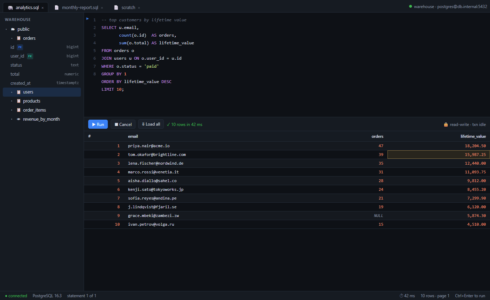
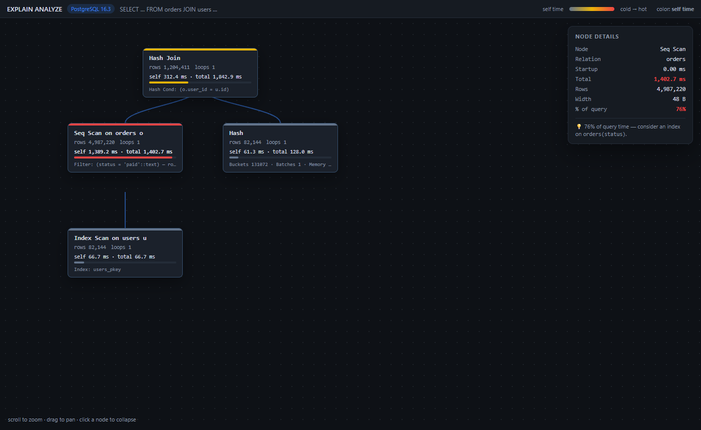
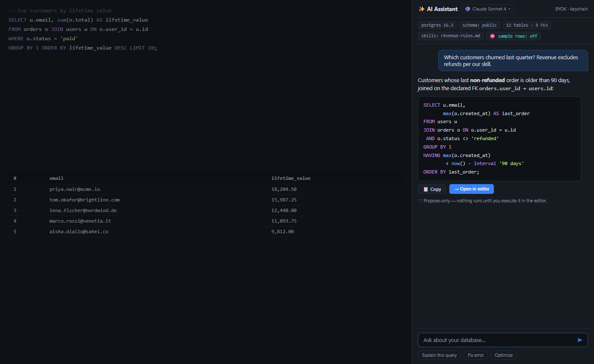

<div align="center">


# Tusk

**A fast, native, lightweight SQL client — Postgres-first.**

Built to replace the clunk of pgAdmin and the weight of DataGrip.

[](https://github.com/willkoman/tusk/actions/workflows/validate.yml)
[](https://github.com/willkoman/tusk/releases/latest)
[](LICENSE)

[Install](#install) · [Features](#features) · [Docs](#documentation) · [Contributing](#contributing)

</div>



Tusk is a desktop SQL workbench built on Rust, [Tauri v2](https://tauri.app), and SolidJS — no Electron, no JVM, no bundled browser. It launches in under a second, idles light, and streams million-row results through a virtualized grid. It treats your data with respect: statements are never silently replayed after a dropped connection, generated SQL is always shown before it runs, and there is **zero telemetry** — nothing leaves your machine without an explicit action.

> **Status:** actively developed. PostgreSQL is first-class; DuckDB, SQLite, and MySQL are fully supported. Installers are unsigned for now (expect a SmartScreen / Gatekeeper prompt on first launch).

## Install

Grab the latest from **[Releases](https://github.com/willkoman/tusk/releases/latest)**:

| Platform | File |
|---|---|
| Windows (x64) | `tusk_x.y.z_x64-setup.exe` or `tusk_x.y.z_x64_en-US.msi` |
| macOS (Apple Silicon) | `tusk_x.y.z_aarch64.dmg` |
| macOS (Intel) | `tusk_x.y.z_x64.dmg` |
| Linux — Flatpak (Bazzite, Silverblue, Kinoite, anything with Flatpak) | `tusk_x.y.z_amd64.flatpak` — `flatpak install ./tusk_x.y.z_amd64.flatpak` |
| Linux — any distribution (Arch, SteamOS, …) | `tusk_x.y.z_amd64.AppImage` — `chmod +x` it and run |
| Linux — Ubuntu 22.04+, Debian 12+, Mint, Pop!_OS | `tusk_x.y.z_amd64.deb` — `sudo apt install ./tusk_x.y.z_amd64.deb` |
| Linux — Fedora 36+, openSUSE | `tusk-x.y.z-1.x86_64.rpm` — `sudo dnf install ./tusk-x.y.z-1.x86_64.rpm` |
| Arch Linux, via pacman | [`packaging/arch/PKGBUILD`](packaging/arch/PKGBUILD) — `makepkg -si`, or `tusk-bin` from the AUR once it is published there |
| Linux on ARM (Raspberry Pi 5, Asahi, ARM laptops) | the same four, named `arm64` / `aarch64`: `…_arm64.flatpak`, `…_aarch64.AppImage`, `…_arm64.deb`, `…aarch64.rpm` |

A built-in updater checks GitHub releases and offers one-click updates. No database handy? Pick **DuckDB** or **SQLite** on the connect screen and leave the path blank for a zero-setup in-memory database.

**Linux notes**

- Every Linux build comes from an Ubuntu 22.04 base, so glibc 2.35 or newer is the floor. The `.deb` and `.rpm` use your distribution's WebKitGTK 4.1 (`libwebkit2gtk-4.1-0` / `webkit2gtk4.1`, pulled in automatically); the AppImage carries WebKitGTK and GTK itself.
- The updater works with the native three: an AppImage replaces itself in place, and a `.deb` or `.rpm` install goes through the system's administrator prompt. The Flatpak updates through Flatpak, so the in-app updater stays quiet inside it.
- The Flatpak runs on the GNOME 50 runtime, keeps its settings under `~/.var/app/com.willko.tusk`, and shares your home directory, the network and the desktop keyring — nothing else. On an immutable distribution such as Bazzite, install the Flatpak or run the AppImage; the `.deb`/`.rpm` installers cannot write to `/usr` there, and Bazzite's [Gear Lever](https://github.com/mijorus/gearlever) adds a menu entry for an AppImage.
- Saved passwords live in the desktop's Secret Service (GNOME Keyring, KWallet, KeePassXC); one of them has to be running.
- Blank window on NVIDIA? Tusk sets `WEBKIT_DISABLE_DMABUF_RENDERER=1` for itself when the proprietary driver is loaded. If a window is still blank or flickers (VMs, some Wayland set-ups), launch with `WEBKIT_DISABLE_DMABUF_RENDERER=1 tusk`, or as a last resort `WEBKIT_DISABLE_COMPOSITING_MODE=1 tusk`.
- An AppImage needs FUSE. If it refuses to start with a FUSE error, run it with `--appimage-extract-and-run` or install `libfuse2` (`libfuse2t64` on Ubuntu 24.04).

## Features

- **Serious SQL editor** — context-aware autocomplete, JOIN conditions proposed from your actual foreign keys, three layers of linting (including server-side validation that never executes your SQL), parameter prompts, and per-statement run buttons.
- **Streaming results grid** — million-row results stream through a two-axis virtualized grid. In-grid editing proves editability first, shows you the exact `UPDATE`/`DELETE`/`INSERT` script, and runs it atomically. Sort, filter, paste from Excel, and copy/export as CSV, TSV, JSON, Markdown, SQL, or Excel.
- **Schema workbench** — lazy schema tree with PK/FK badges, indexes, and sizes; right-click DDL forms with live SQL preview; diff-based Modify Table; and copy-DDL on all four engines.
- **Plans & relationships** — visual `EXPLAIN` as a pan/zoom heat-colored tree on all engines, plus an interactive FK graph and whole-schema ERD.
- **Manual transactions** — `BEGIN`/`COMMIT`/`ROLLBACK` tracked with a live timer and per-engine capability support, validated before anything is sent.
- **AI assistant (BYOK, optional)** — a docked chat grounded in your real schema and FK graph. Ten providers (Anthropic, OpenAI, Gemini, OpenRouter, Groq, Ollama, LM Studio, …). Generated SQL is propose-only — there is no auto-execute path. Keys live in the OS keychain.
- **Slack bot (optional)** — ask your database questions from Slack. The bot proposes SQL that runs only after the requester clicks Approve, on a fresh read-only connection validated in code. Self-hosted via Socket Mode — no third-party relay.
- **Safe by default** — engine-enforced read-only mode, reconnect-but-never-replay after dropped connections, atomic multi-statement scripts, passwords in the OS keychain, no telemetry, and opt-in local crash reporting.

Supported engines: **PostgreSQL** (first-class), **DuckDB**, **SQLite**, **MySQL**. All share streaming results, visual EXPLAIN, ERD, Copy DDL, six-format export, and read-only enforcement.

<table>
  <tr>
    <td><br><sub><b>Visual EXPLAIN</b> — heat-colored plan tree with per-node details, on all four engines.</sub></td>
    <td><br><sub><b>AI assistant</b> — grounded in your real schema and FK graph; propose-only, BYOK, zero data leaves by default.</sub></td>
  </tr>
</table>

## Development

Prerequisites: [Rust](https://rustup.rs) and Node 20+. No database server needed — DuckDB/SQLite run in-memory.

```sh
npm install
npm run tauri dev
```

```sh
# quick pre-flight
npm run build && npm run typecheck && npx vitest run
cargo test --locked --manifest-path src-tauri/Cargo.toml
```

The full validation matrix (lint, clippy, four-engine driver conformance, dependency gates) and project conventions live in **[CONTRIBUTING.md](CONTRIBUTING.md)**.

## Documentation

- **In-app manual** — press `F1` in Tusk: 16 searchable topics, always matching your build and keybindings.
- [`docs/manual-transactions.md`](docs/manual-transactions.md) — transaction syntax and per-engine capability matrix.
- [`docs/slack-setup.md`](docs/slack-setup.md) — Slack bot setup and security model.
- [`docs/adversarial-hardening.md`](docs/adversarial-hardening.md) — resource budgets and input validation.
- [`CLAUDE.md`](CLAUDE.md) — deep architecture tour.
- [`CHANGELOG.md`](CHANGELOG.md) — release notes.

## Contributing

Issues and PRs welcome — see **[CONTRIBUTING.md](CONTRIBUTING.md)** for setup, validation gates, and conventions.

## License

[MIT](LICENSE)
